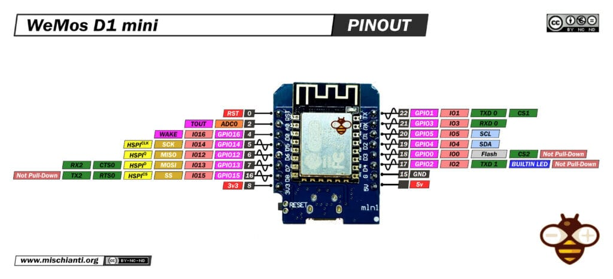

# ESP8266 / Siemens T37h

## High Level overview

Core Features:

- ASCII / Baudot conversion with bit-banging
- UART for all types of common (dumb) terminals
- WebAPI for simple GET / POST request

## Design Goal

I want to have a old Teletype and an vintage Glass Terminal side-by-side talking to each other, while a Computer can send data over WiFi to both of them.
In Context of an ASR33: You can punch your paper Tape via HTTP with zero hustle

## BooTY

During the design phase it dawns to have a small user interface to change settings.
Keep in mind that the following assumptions has been made:

I. Assumptions regarding the Teletype hardware:
    1. works with at least 5Bit Baudot (CCITT-2)
    2. has a default symbol rate of 45.45Bd.
    3. Can tolerate a 1.5 Stopbit
    4. A single Line is not longer then 255 Characters
    5. A logic HIGH is represented as V+ and LOW is 0V
        - You need to provide a current loop interrupter yourself 
    6. User want loopback mode
II. UART
    1. The console works with 9600Bd 8N1
    2. Hardware Flow Control 
        - Firmware (CTE) sends CTS for syncing with the TTY
    1. A Teletype shall at least support 5-Bit Baudot

BooTY is a terse user interface directly on the teletype for customization.
Changing system properties via the Teletype-Object-Manager (TO-Manager / to_manager.h) is only meant to get started.

## Pin definitions

| PIN | LABEL | DIRECTION | FUNCTION |
| --  | --    | --        | --       |
| D0 | TTY_RECV | INPUT | Receive Pin for TTY |
| D5 | TTY_SEND | OUTPUT | Send Pin for TTY |
| D6 | SER_RX | INPUT | Receive Pin for UART |
| D7 | SER_TX | OUTPUT | Send Pin for UART |
| D8 | SER_CTS | OUTPUT | CLEAR-TO-SEND for HW-Flow Control |
| D1 | TTY_INHIBIT | OUTPUT | BSY-Flag from µC for TTY-Operator |
| D2 | BOOTY | INPUT | Start into BooTY after RST |
| D3 | --- | UNUSED | --- |
| RST| RESET | RESET | Reset Pin 
