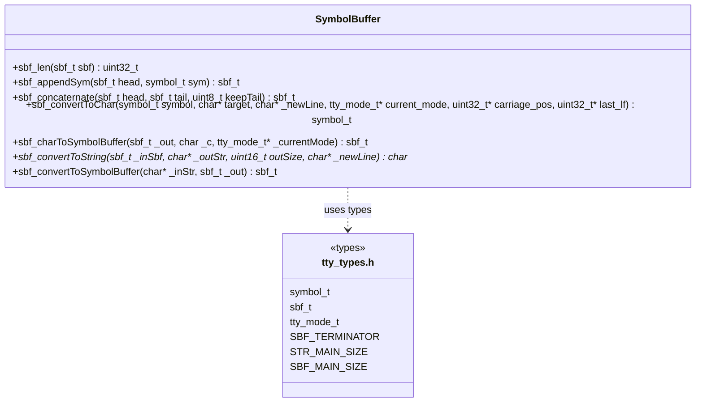
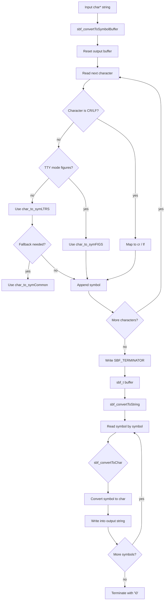

# Symbolbuffer

Der `Symbolbuffer` kapselt die Konvertierung zwischen normalem C-String und dem 5-Bit-Symbolformat des TTYs. In diesem Projekt arbeitet er auf festen RAM-Puffern und nicht mehr über Heap-Allokation.

## Klassendiagramm

## Flowchart

## Kurzbeschreibung

- `sbf_len` sucht den Terminator im Symbolbuffer.
- `sbf_appendSym` hängt ein Symbol an, solange der feste Puffer noch Platz hat.
- `sbf_concaternate` kopiert einen zweiten Buffer an den ersten Buffer an.
- `sbf_convertToChar` wandelt ein Symbol zurück in ein Zeichen.
- `sbf_charToSymbolBuffer` wandelt ein einzelnes Zeichen in ein Symbol um.
- `sbf_convertToString` erzeugt aus einem Symbolbuffer einen C-String.
- `sbf_convertToSymbolBuffer` erzeugt aus einem C-String einen Symbolbuffer.

## Verwendete Puffer

- `sbf_main[300]` ist der feste Symbolbuffer.
- `str_main[256]` ist der feste Stringbuffer.
- Beide liegen in `tty.c` und werden von der TTY-Schicht gemeinsam benutzt.
